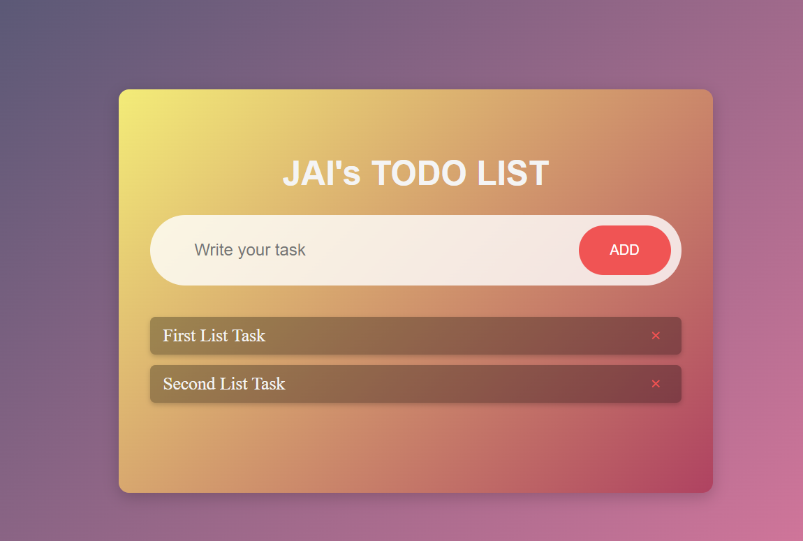

<h2>To-Do List Application</h2>
<h3>Overview</h3>
This is a simple to-do list web application built using HTML, CSS, and JavaScript. The to-do list allows users to add, edit, and delete tasks, with the tasks stored in the browser's local storage so they persist even after the page is refreshed.

<h3>Features</h3>
Add new tasks.
Edit existing tasks.
Mark tasks as completed by clicking on them.
Delete tasks.
The tasks are stored in the browser's local storage, so they are available even after the page is refreshed or closed.
<h3>How to Use the To-Do List</h3>

Adding a Task:
Type your task in the input box and click the "Add" button to add the task to the list.
The task will automatically appear below, and it will also be stored in local storage.

Editing a Task:
Double Click on the task to edit it. The text will appear in the input box, allowing you to modify it. Once edited, press the "Add" button again to save the changes.

Deleting a Task:
Click on the delete button (represented by a span or any other icon) next to the task to remove it from the list and local storage.

Marking a Task as Completed:
Clicking on a task will mark it as completed by applying a strikethrough effect. It will also be saved in the completed state within the local storage.

<h2>How Local Storage is Used</h2>
The localStorage object in JavaScript allows you to store data in the browser without an expiration time. Here's how it's implemented in the to-do list:

Saving Tasks: When a new task is added, the list of tasks is stored in local storage as a string using JSON.stringify().
Loading Tasks: When the page loads, the application checks if there are tasks stored in local storage. If there are, they are retrieved using localStorage.getItem() and parsed back into an array using JSON.parse(). The tasks are then displayed on the page.
Updating Local Storage: Whenever a task is added, edited, or deleted, the array of tasks is updated in local storage using localStorage.setItem().

<h3>How appendChild is Used</h3>
The appendChild() method is used to dynamically add a new element to an existing element. In the to-do list, it's used to add each task to the unordered list (<ul>). Here's how it works:

Create an Element: A new <li> element is created to represent the task.
Set the Text and Attributes: The text of the task is set, and necessary classes are applied.
Append the Element: The newly created <li> element is appended to the parent <ul>.

How to Set Up and Run
Download the project or clone it from the repository.
Open index.html in your browser to run the to-do list app.
Start adding tasks and see how they are stored using local storage.
Future Improvements
Add categories to tasks.
Set due dates for tasks.
Implement search functionality.